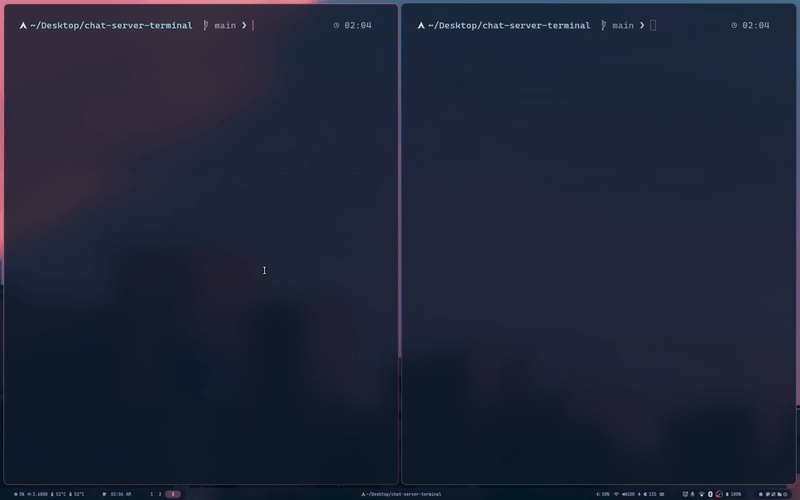

<a  id="readme-top"></a>


  
  
  
  

<!-- TABLE OF CONTENTS -->

<details>

<summary>Table of Contents</summary>

<ol>

<li>

<a  href="#Chat-Server-Terminal">Chat-Server-Terminal - Simple FTXUI server clinet socket terminal app</a>

<ul>

<li><a  href="#Features">Features</a></li>

</ul>

</li>

<li>

<a  href="#getting-started">Getting Started</a>

<ul>

<li><a  href="#prerequisites">Prerequisites</a></li>

<li><a  href="#bulding-alterm">Bulding Alterm</a></li>

</ul>

</li>

<li><a  href="#project-structure">Project Structure</a></li>

<li><a  href="#usage">Usage</a></li>

<li><a  href="#settings-keys">Settings Keys</a></li>

<li><a  href="#license">License</a></li>

<li><a  href="#future-work">Future Work</a></li>

<li><a  href="#what-i-learned">What I Learned</a></li>

</ol>

</details>

  
  
  

<!-- ABOUT THE PROJECT -->

# Chat-Server-Terminal - Simple FTXUI server clinet socket terminal app

**Chat-Server-Terminal** is a **terminal-based client-server chat system written in C++**, featuring an interactive **TUI(Text User Interface)** built with **FTXUI**, presistent user management using **SQLite**, and a modular architecture designed with real-world system principles.


The project focuses on **engineering clarity**, **separation of concerns**, and **Linux-first development**, rather than begin a simple demo chat app.
  
  
  

<p  align="right">(<a  href="#readme-top">back to top</a>)</p>

  
  
  

## Features

  

- [x] **Client-Server Architecture** (TCP sockets)
- [x] **Interactive Terminal UI** (**FTXUI**)

- [x] **User Authentication System**
    - [x] Login
    - [x] Registration
    - [x] Password validation

- [x] **SQLite Database Integration**
    - [x] Persistent user storage
    - [x] Unique usernames

- [x] **Post-Login Menu System**
    - [x] Enter Chat
    - [x] Settings
    - [x] Server Info
    - [x] Logout

- [x] **Settings Panel**
    - [x] Account settings
    - [x] Network info
- [x] **Server Information Panel**
    - [x] Local IPs
    - [x] Active port
- [x] **Keyboard** + **Mouse Navigation**
- [x] **Modular, Extensible Codebase**

  
  

## ScreenShots

  



  
  
  
  

<p  align="right">(<a  href="#readme-top">back to top</a>)</p>

  
  
  
  

<!-- GETTING STARTED -->

## Getting Started

  

These instructions will help you build and run **chat-server-termianl**.

  

### Prerequisites

  

Make sure you have the following installed on you system:

- [g++](https://gcc.gnu.org/) version 11 or higher

- [cmake](https://cmake.org/) version 3.21 or higher

- [FTXUI](https://www.libsdl.org/) version 2.0 or higher

- [SQLite3](https://www.libsdl.org/projects/SDL_ttf/)

- [pkg-config]()

- Linux-based system (Arch, Debian, Ubuntu, WSL)


  
  

## Building 

  

Clone the repository and build the project using the provided Makefile.

```bash

$  git clone https://github.com/zoldyck13/chat-server-terminal.git

$  cd chat-server-terminal


```
Build using MakeFile:

```bash

$  make

```
The compiled binaries will be generated in the build directory.
  

#### Project Structure

```

chat-server-terminal/
├── include/
│   ├── client/
│   │   ├── ChatState.hpp
│   │   ├── ChatUI.hpp
│   │   ├── ClienSocket.hpp
│   │   ├── Login.hpp
│   │   ├── Menu.hpp
│   │   ├── Register.hpp
│   │
│   ├── server/
│   ├── Dbserver.hpp
│   ├── Launch.hpp
│   ├── login.hpp
│   ├── Menu.hpp
│   ├── Register.hpp
│   ├── Settings.hpp
│   ├── User.hpp
│   ├──utility.hpp
│   ├── handelclient.hpp
│   └── Server.hpp
│
├── src/
│   ├── client/
│   │   ├── client_ftxui.cpp
│   │   ├── ClientSocket.cpp
│   │      
│   ├── server/
│       ├── Dbserver.cpp
│       ├── mainServer.cpp
│       ├── Server.cpp
│    
│
├── assets/
├── Makefile
├── README.md
├── LICENSE
└── admin.db
  

```


### Usage
---

**1.** Start the server:


```bash

$ ./server.out

```

**2.** Start the client:

```bash

$ ./clientui.out  

```
**3.** Register or log in

**4.** Navigate using keyboard or mouse

**5.** Ente chat or manage settings
  

### Future Work

- [ ] Real-time multi-client chat
- [ ] Message history presistence
- [ ] Scrollbale chat view
- [ ] User roled(admin / user)
- [ ] Encryption (TLS)
- [ ] headless server mode
- [ ] Configuration file support

  
  


  
  

---

## What I Learned

- Designing **client–server systems** in C++
  
- Managing **stateful TUIs** without blocking render loops

- Integrating **SQLite** safely

- Handling **event-driven UI** with FTXUI

- Thinking beyond “it works” → toward **maintainable systems**
  
  
  

## Licnese

  

This project is licensed under the MIT License - see the [LICENSE](LICENSE) file for details.
